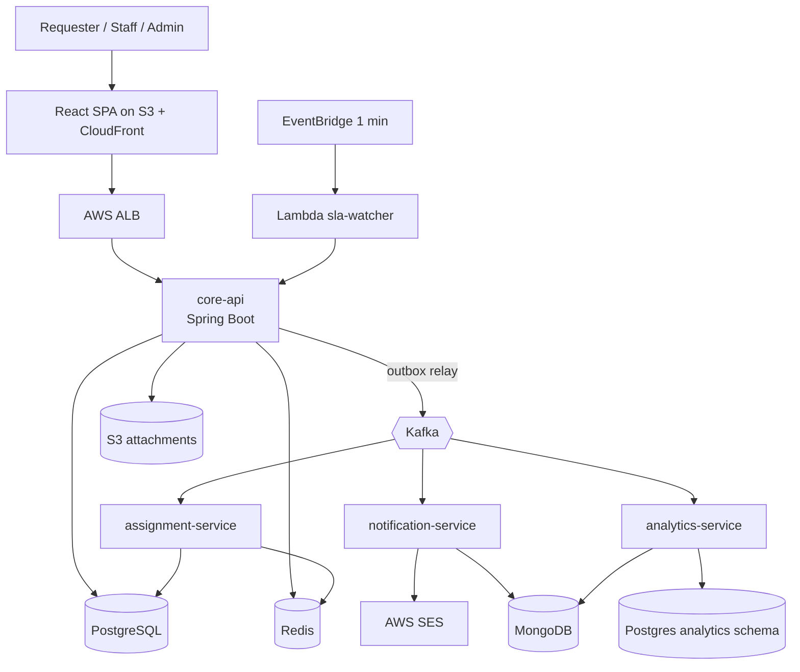

# CampusFlow — Architecture

## 1. Style

**Modular monolith first, selective service extraction.** `core-api` owns the transactional domain (users, requests, admin). Three services are extracted because they have different scaling and failure profiles:

| Service | Why separate |
|---|---|
| `assignment-service` | CPU-light but latency-sensitive, stateless consumer, scales on Kafka lag |
| `notification-service` | Slow external I/O (SMTP/SES); must never block request creation |
| `analytics-service` | Read-heavy aggregation; isolated from OLTP load |

Plus a **serverless** function (`sla-watcher`, AWS Lambda) triggered by EventBridge every minute.

## 2. Tech Stack

| Layer | Choice | Reason |
|---|---|---|
| Language | Java 21 (virtual threads on) | JD core requirement |
| Framework | Spring Boot 3.3+, Spring Web, Spring Validation | Industry standard |
| ORM | Spring Data JPA + Hibernate 6 | JD calls out Hibernate |
| Security | Spring Security 6, JWT (jjwt), BCrypt | JD security line |
| OLTP DB | PostgreSQL 16 | ACID, partial indexes, `SKIP LOCKED`, full-text search |
| Document DB | MongoDB 7 | Activity feed, notification log, flexible event payloads |
| Cache / locks | Redis 7 | Cache-aside, rate limiting, token blacklist, distributed lock |
| Messaging | Apache Kafka (KRaft) | Async assignment, notifications, analytics |
| Migrations | Flyway | Versioned schema |
| Mapping | MapStruct | No reflection mapping boilerplate |
| API docs | springdoc-openapi | Swagger UI |
| Resilience | Resilience4j | Retry, circuit breaker, rate limiter |
| Observability | Actuator, Micrometer, Prometheus, Grafana, Logback JSON | Production habits |
| Testing | JUnit 5, Mockito, Testcontainers, REST Assured, k6 | Unit, integration, load |
| Build | Maven (multi-module) | Common in enterprise Java |
| Containers | Docker, Docker Compose | Local parity |
| CI | GitHub Actions (primary) + Jenkinsfile (mirror) | JD "plus" |
| Cloud | AWS: ECS Fargate, ALB, RDS Postgres, ElastiCache, MSK (or self-hosted Kafka on EC2 for cost), DocumentDB/Atlas, S3, SES, Lambda, EventBridge, Secrets Manager, CloudWatch, ECR | JD "plus" |
| IaC | Terraform (minimal) | Reproducible deploy |
| Frontend | React 18 + Vite + TypeScript + TanStack Query + Tailwind (token-driven) | Light, fast |

## 3. System Context



## 4. Repository Layout

```
campusflow/
├── docs/                      # PRD, ARCHITECTURE, SYSTEM_DESIGN, DESIGN, ADRs
├── backend/
│   ├── pom.xml                # parent
│   ├── common/                # event contracts, error model, shared DTOs
│   ├── core-api/
│   ├── assignment-service/
│   ├── notification-service/
│   ├── analytics-service/
│   └── sla-watcher/           # Lambda (Java 21, SnapStart)
├── frontend/
├── infra/
│   ├── docker/                # compose files, prometheus, grafana
│   └── terraform/
├── load-tests/k6/
├── .github/workflows/
├── Jenkinsfile
└── README.md
```

## 5. core-api Package Structure (package-by-feature)

```
com.campusflow.core
├── auth/            controller, service, jwt, refresh-token, rate-limit filter
├── user/            entity, repository, service, controller
├── department/
├── request/
│   ├── api/         RequestController, DTOs, request/response mappers
│   ├── domain/      ServiceRequest, Status, Priority, RequestStateMachine
│   ├── service/     RequestService, CommentService, SlaPolicyService
│   ├── repo/        RequestRepository, specifications, cursor queries
│   └── event/       RequestEventPublisher (writes to outbox)
├── outbox/          OutboxEvent, OutboxRelay (poller → Kafka)
├── attachment/      S3 presigned upload
├── admin/
├── config/          Security, Redis, Kafka, OpenAPI, Async
└── shared/          ApiError, exception handlers, correlation filter
```

Rule: a feature package may depend on `shared` and on another feature's **service interface only**, never its repository or entities. This keeps extraction possible.

## 6. Design Patterns (and where)

| Pattern | Location | Purpose |
|---|---|---|
| **State** | `RequestStateMachine` | Legal transitions encoded once, testable in isolation |
| **Strategy** | `AssignmentStrategy` (LeastLoaded, RoundRobin, SkillMatch) | Swap algorithms by config |
| **Chain of Responsibility** | `EscalationChain` (Technician → Dept Head → Admin) | SLA escalation |
| **Observer / Event-driven** | Domain events → outbox → Kafka | Decoupling |
| **Factory** | `NotificationChannelFactory` | Email, in-app, future SMS |
| **Builder** | Event and DTO construction | Immutable objects |
| **Specification** | `RequestSpecifications` | Composable filters |
| **Template Method** | `AbstractEventConsumer` | Idempotency + retry skeleton |
| **Transactional Outbox** | `outbox` module | Atomic DB write + event publish |
| **Cache-Aside** | Department/category/routing lookups | Read scaling |

## 7. Event Contracts (Kafka)

Envelope (all events):

```json
{
  "eventId": "uuid",
  "type": "request.created",
  "version": 1,
  "occurredAt": "2026-10-07T10:15:30Z",
  "aggregateId": "request-uuid",
  "correlationId": "uuid",
  "payload": { }
}
```

| Topic | Key | Producer | Consumers | Partitions |
|---|---|---|---|---|
| `request.created.v1` | requestId | core-api | assignment, analytics, notification | 6 |
| `request.assigned.v1` | requestId | assignment / core | notification, analytics | 6 |
| `request.status-changed.v1` | requestId | core-api | notification, analytics | 6 |
| `request.comment-added.v1` | requestId | core-api | notification | 3 |
| `sla.warning.v1` / `sla.breached.v1` | requestId | core-api (via Lambda call) | notification, analytics | 3 |
| `*.dlq` | — | any consumer | ops | 1 |

Keying by `requestId` guarantees per-request ordering.

## 8. Data Ownership

| Store | Owner | Contents |
|---|---|---|
| Postgres `core` schema | core-api | users, departments, requests, comments, history, outbox, refresh_tokens, sla_policies, routing_rules, technician_profiles |
| Postgres `analytics` schema | analytics-service | daily aggregates, technician stats, hotspot tables |
| MongoDB | notification + analytics | `notifications`, `activity_feed`, `event_log` |
| Redis | core-api, assignment | cache, rate limits, JWT blacklist, workload counters, locks |
| S3 | core-api | attachments (presigned PUT/GET) |

No service reads another service's tables. Cross-service data flows through events or APIs.

## 9. Security Architecture

- Stateless JWT (HS256 in dev, RS256 + key rotation in prod via Secrets Manager).
- Filter chain: CorrelationId → RateLimit → JwtAuth → Authorization (`@PreAuthorize`).
- Ownership checks in the service layer (`request.requesterId == principal.id` etc.), not only role checks.
- Validation: Jakarta Validation on DTOs, size and MIME checks on uploads, HTML-escaped output.
- CORS allow-list, security headers, CSRF disabled for stateless API (documented).
- Secrets only from env/Secrets Manager; `.env.example` committed, `.env` ignored.
- Service-to-service: internal network + shared service token for Lambda → core-api endpoint.
- PII: only name/email/phone stored; logs never include tokens or passwords.

## 10. Deployment Topology (AWS)

```
Route53 → CloudFront (SPA from S3) 
        → ALB → ECS Fargate: core-api (2 tasks, autoscale on CPU/RPS)
                             assignment-service (1–3, autoscale on Kafka lag)
                             notification-service (1–2)
                             analytics-service (1)
RDS PostgreSQL (Multi-AZ, private subnet)   ElastiCache Redis
MSK or Kafka on EC2 (cost mode)             MongoDB Atlas free tier / DocumentDB
Lambda sla-watcher ← EventBridge (rate 1 minute)
ECR (images)  Secrets Manager  CloudWatch Logs/Alarms  SES  S3
```

Environments: `local` (Compose), `staging` (single task each, small instances), `prod` (documented, optional to deploy).

## 11. CI/CD

GitHub Actions pipeline on every PR:
1. `mvn -B verify` (unit + Testcontainers integration)
2. Checkstyle + SpotBugs + OWASP dependency-check
3. Build Docker images (multi-stage, distroless/temurin-jre)
4. On `main`: push to ECR, deploy to ECS staging, run smoke tests
5. On tag: manual approval → prod

`Jenkinsfile` mirrors stages (Checkout → Build → Test → Scan → Image → Deploy) with the same Maven and Docker commands so either CI works.

## 12. ADRs (keep as separate files in `docs/adr/`)

| # | Decision | Alternative rejected | Reason |
|---|---|---|---|
| 001 | PostgreSQL for core | MongoDB | Relational integrity, transactions, state machine, joins for analytics |
| 002 | Modular monolith + 3 services | Full microservices | Operational cost; extract only where scaling differs |
| 003 | Transactional outbox | Dual write / `@TransactionalEventListener` only | Guarantees no lost events |
| 004 | Kafka | RabbitMQ / SQS | Replay, partition ordering, consumer groups, analytics fan-out |
| 005 | Optimistic locking | Pessimistic locks | Low contention, better throughput, user-visible conflict handling |
| 006 | Cursor pagination | Offset | Stable performance at depth |
| 007 | MongoDB for activity feed | Postgres JSONB | Append-heavy, schema-flexible, shows polyglot persistence with a reason |
| 008 | Lambda for SLA checks | `@Scheduled` on every instance | No duplicate runs, no idle compute, serverless exposure |
