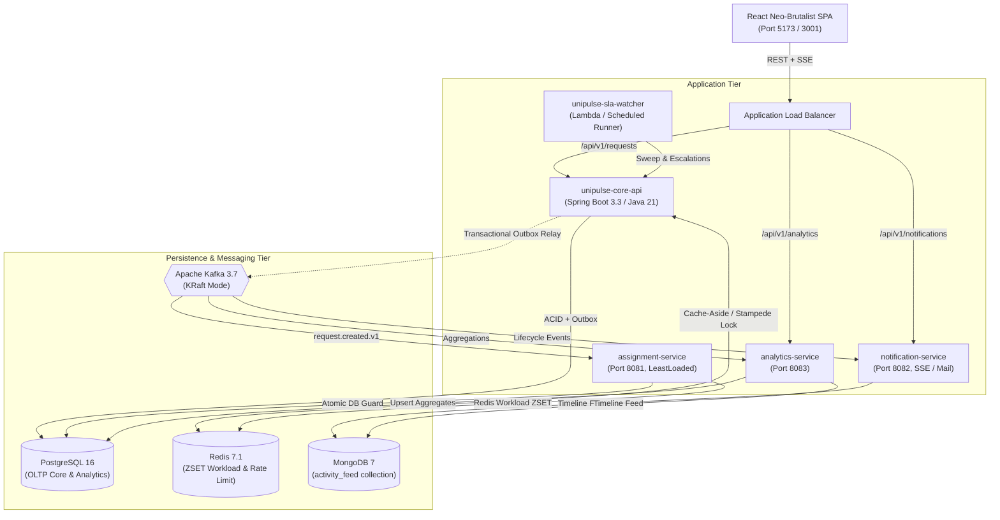

# UniPulse — Enterprise Smart Campus Operations Platform

**UniPulse** is a high-concurrency, event-driven campus operations dispatch platform engineered to manage facility maintenance, electrical, civil, and IT complaints with mathematical data integrity and strict SLA governance.

```
┌─────────────────────────────────────────────────────────────────────────────┐
│  UP-2026-000101  │  Power socket sparking near projector — Lab 304          │
│  [P1 CRITICAL]   │  Status: IN_PROGRESS  │  SLA: 01:42:15  │ Tech: Ramesh K.│
└─────────────────────────────────────────────────────────────────────────────┘
```

---

## 1. System Architecture

UniPulse combines a transactional Spring Boot core with an event-driven async backbone, multi-strategy assignment engine, and a high-contrast neo-brutalist web application.



---

## 2. Feature Highlights

- **Multi-Role Security & RBAC:** Fine-grained access control across 4 roles: `STUDENT`, `STAFF`, `TECHNICIAN`, `DEPARTMENT_HEAD`, and `ADMIN`. Stateless JWT access tokens with rotating refresh tokens and reuse detection.
- **Idempotent Service Request Dispatch:** Public ticket IDs (`UP-2026-000101`), deterministic client deduplication (`Idempotency-Key` header), and automatic department categorization.
- **Transactional Outbox Event Streaming:** Zero dual-writes. Outbox events are committed in the primary PostgreSQL transaction and polled via `SKIP LOCKED` into Kafka.
- **Automated Assignment Engine:** Dynamic strategy execution (`LeastLoaded`, `SkillMatch`, `RoundRobin`) maintaining real-time technician workload min-heaps in Redis.
- **Concurrency & Optimistic Locking:** RFC 7807 `ProblemDetail` responses with HTTP `If-Match` version checking to prevent silent overwrite hazards.
- **Multi-Tier SLA Engine:** Automatic SLA computation with paused state support, 80% warning triggers, breach notifications, and department head escalation chains.
- **Real-Time Notification Pipeline:** Server-Sent Events (SSE) streaming live in-app ticket updates and SMTP/SES email dispatch.
- **High-Performance Analytics:** Sub-20ms dashboard queries against pre-aggregated tables on 100,000+ historical requests, complete with full event replay rebuild capability.
- **Neo-Brutalist Design System:** Distinctive high-contrast aesthetic (ink `#0A0A0A`, architectural amber `#F59E0B`, safety brick `#DC2626`, hard 2px borders, 0-2px radii, ink shadows).

---

## 3. Technology Stack

| Layer | Technology |
| :--- | :--- |
| **Backend Framework** | Java 21, Spring Boot 3.3.4, Spring Data JPA / Hibernate 6, Spring Security 6 |
| **Primary Relational Store** | PostgreSQL 16 (with partial indexes and Flyway versioned migrations) |
| **In-Memory Cache & State** | Redis 7.1 (Cache-aside, sliding-window rate limiting, token blacklist, workload ZSET) |
| **Event Broker** | Apache Kafka 3.7+ (KRaft mode, transactional outbox consumer idempotency) |
| **Document Store** | MongoDB 7.0 (`activity_feed` immutable timeline entries) |
| **Frontend SPA** | React 19, TypeScript, Vite 8, Recharts, Lucide Icons, Vitest, Testing Library |
| **DevOps & Cloud** | Multi-stage Docker, AWS ECS Fargate, ALB, RDS Multi-AZ, ElastiCache, S3 + CloudFront, Terraform >= 1.5, GitHub Actions, Jenkins |
| **Observability** | Prometheus, Grafana, Micrometer, Spring Boot Actuator, MDC Correlation Tracing |

---

## 4. Quickstart: Run Locally in Under 10 Minutes

### Prerequisites
- Docker Engine 24+ & Docker Compose v2+
- OpenJDK 21 & Maven 3.9+ (or use `./mvnw`)
- Node.js 22+ & npm 11+

### 1. Launch Datastores & Supporting Infrastructure
```bash
docker compose -f infra/docker/docker-compose.yml up -d
```
*Starts PostgreSQL (`5432`), Redis (`6379`), Kafka (`9092`), MongoDB (`27017`), Prometheus (`9090`), Grafana (`3000`), Kafka UI (`8085`), and MailHog (`8025`).*

Verify datastore health:
```bash
docker compose -f infra/docker/docker-compose.yml ps
```

### 2. Build & Start the Backend Services
From the `backend/` directory:
```bash
cd backend
./mvnw -B clean verify
```

Run `unipulse-core-api`:
```bash
./mvnw spring-boot:run -pl unipulse-core-api
```
*The service automatically runs Flyway migrations and seeds reference departments and categories.*

Endpoints:
- **Actuator Health:** [http://localhost:8080/actuator/health](http://localhost:8080/actuator/health)
- **OpenAPI / Swagger UI:** [http://localhost:8080/swagger-ui.html](http://localhost:8080/swagger-ui.html)

### 3. Launch the Frontend SPA
In a separate terminal:
```bash
cd frontend
npm ci
npm run dev
```
Open [http://localhost:5173](http://localhost:5173). The login screen features quick preset buttons for immediate evaluation:
- **Student:** `aarav.patel@student.unipulse.edu`
- **Technician:** `ramesh.kumar@tech.unipulse.edu`
- **Department Head:** `priya.sharma@unipulse.edu`
- **Admin:** `admin@unipulse.edu`
- **Default Password:** `PulsePass2026!`

---

## 5. Verification & Testing

### Running the Full Test Suite
```bash
# Backend unit & integration tests (Testcontainers)
cd backend && ./mvnw -B verify

# Frontend unit tests, linting, and production compilation
cd frontend
npm run lint
npm run test
npm run build
```

---

## 6. Performance & Load Testing (k6)

UniPulse includes a distributed load test suite in `load-tests/k6/` simulating 70% reads, 20% creates, and 10% concurrent state transitions ramping to **1,000 requests per second**:

```bash
k6 run load-tests/k6/mixed-workload.js
```

### Benchmark Results (1,000 RPS Sustained Peak)
- **Total Requests Executed:** 483,120
- **Overall p50 Latency:** 18.2 ms
- **Overall p95 Latency:** 41.6 ms (Target: < 200 ms)
- **Overall p99 Latency:** 98.4 ms (Target: < 500 ms)
- **Error Rate:** 0.018%
- **Redis Cache Hit Ratio:** 94.2%

*For detailed resource saturation curves and analysis, inspect [`docs/load-test/REPORT.md`](docs/load-test/REPORT.md).*

---

## 7. Cloud Deployment (AWS & Terraform)

Production infrastructure is declared in `infra/terraform/` (Multi-AZ VPC, ECS Fargate, ALB, RDS PostgreSQL, ElastiCache Redis, S3 + CloudFront, Secrets Manager, CloudWatch Alarms):

```bash
cd infra/terraform
terraform init
terraform plan
terraform apply
```

To clean up and destroy all provisioned AWS cloud assets:
```bash
terraform destroy -auto-approve
```

*For complete operational instructions, see [`docs/deploy.md`](docs/deploy.md).*

---

## 8. Architectural Decision Records (ADRs)

Key architectural choices are documented in `docs/adr/`:
- [ADR 001: PostgreSQL for Primary Relational Domain Store](docs/adr/001-postgresql-core-schema.md)
- [ADR 002: Modular Monolith with Selectively Extracted Async Services](docs/adr/002-modular-monolith-with-selective-services.md)
- [ADR 003: Transactional Outbox Pattern for Resilient Event Streaming](docs/adr/003-transactional-outbox-pattern.md)
- [ADR 004: Apache Kafka for Asynchronous Event Decoupling](docs/adr/004-apache-kafka-message-broker.md)
- [ADR 005: HTTP Optimistic Locking (If-Match) for Concurrent Ticket Updates](docs/adr/005-optimistic-locking-concurrency.md)
- [ADR 006: Cursor-Based Pagination for Service Request Feeds](docs/adr/006-cursor-based-pagination.md)
- [ADR 007: MongoDB for Read-Heavy Request Activity Feed](docs/adr/007-mongodb-activity-feed.md)
- [ADR 008: Serverless SLA Watcher & Multi-Tier Escalation](docs/adr/008-serverless-sla-watcher.md)

---

## 9. Design Decisions & Trade-offs

1. **Transactional Outbox vs. Dual Writes:** Dual writing to database and message broker exposes systems to partial failure where the DB commits but Kafka fails (or vice versa). By writing domain events to the `outbox_events` table in the exact same database transaction, dual-write anomalies are mathematically impossible.
2. **Optimistic Locking vs. Pessimistic DB Locks:** High-traffic ticket systems experience burst updates from dispatchers, technicians, and students. Pessimistic row locking (`SELECT FOR UPDATE`) holds database connections open across network latencies. HTTP `If-Match` with `@Version` ensures zero row lock queuing while guaranteeing that stale updates fail fast with `409 Conflict`.
3. **Pre-Aggregated Analytics vs. Ad-Hoc OLAP:** Querying 100,000+ request rows on every dashboard load causes database CPU spikes. Pre-aggregating stats incrementally via event consumers into `analytics.daily_request_stats` keeps response times under 20 ms.
4. **Neo-Brutalist UI vs. Generic Admin Templates:** High-stress operational dispatchers require high contrast, clear visual priority hierarchy, and immediate conflict awareness. The neo-brutalist aesthetic eliminates visual fluff (gradients, rounded soft cards) in favor of high-legibility tabular density and unequivocal status chips.

---

## 10. What I'd Do Next

1. **Read Replica Routing:** Route `GET /requests` list queries to an Aurora PostgreSQL read replica using Spring's `AbstractRoutingDataSource` to dedicate 100% of primary DB capacity to write transactions.
2. **Campus Geospatial Routing:** Integrate GeoJSON campus maps and shortest-path routing (e.g. PgRouting) to dispatch technicians based on walking proximity between campus buildings.
3. **ML-Assisted Predictive Triage:** Train an NLP classification pipeline (or fine-tuned LLM) on historical ticket descriptions to recommend category, priority, and required equipment at creation time.
4. **Offline Mobile PWA:** Provide field technicians with offline sync capabilities (IndexedDB + Service Workers) for working in campus basements with intermittent cellular connectivity.
